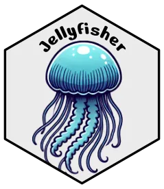

#  Jellyfisher

<!-- badges: start -->

[](https://github.com/HautaniemiLab/jellyfisher/actions/workflows/R-CMD-check.yaml)
[](https://CRAN.R-project.org/package=jellyfisher)

<!-- badges: end -->

**Jellyfisher** is an R package for visualizing tumor evolution and subclonal
compositions using Jellyfish plots, which display both spatial and temporal
dimensions in a single unified figure.

The package is based on the
[Jellyfish](https://github.com/HautaniemiLab/jellyfish) visualization tool,
bringing its functionality to R users. Jellyfisher supports both
[ClonEvol](https://github.com/hdng/clonevol) results and plain data frames,
making it compatible with various tools and workflows.


## Installation

### Install from CRAN

```R
install.packages("jellyfisher")
```

### Or alternatively, install the latest development version from GitHub

```R
devtools::install_github("HautaniemiLab/jellyfisher", build_vignettes = TRUE)
```

## Usage

Jellyfisher is designed to work with data frames or ClonEvol results.

### Plotting Data Frames

The input data should follow specific structures for _samples_, _phylogeny_, and
subclonal _compositions_, which are described in the
[`jellyfisher`](https://hautaniemilab.github.io/jellyfisher/reference/jellyfisher.html)
function's documentation.

#### Example

```R
library(jellyfisher)

# Plot the bundled example data
jellyfisher(jellyfisher_example_tables)
```

### Plotting ClonEvol Results

Jellyfisher provides a straightforward way to visualize
[ClonEvol](https://github.com/hdng/clonevol) results using the
[`extract_tables_from_clonevol`](https://hautaniemilab.github.io/jellyfisher/reference/extract_tables_from_clonevol.html)
function. See the reference page for details.

#### Example

```R
library(clonevol)
library(jellyfisher)

# Run ClonEvol. Check the ClonEvol documentation for details.
y <- infer.clonal.models(...)
y <- convert.consensus.tree.clone.to.branch(y)

# Plot the results
extract_tables_from_clonevol(y, model = 1) |>
  jellyfisher()
```

### Setting Parent-Child Relationships of Samples

By default, all samples that have no explicit parent are children of the
_inferred root_ sample. You can customize the parent-child relationships by
modifying the `parent` column in the `samples` data frame before plotting.

You can also modify the relationships with ease using the
[`set_parents`](https://hautaniemilab.github.io/jellyfisher/reference/set_parents.html)
function.

For example, if you have three samples, A, B, and C, they will have the
following relationships by default:

```
    Root
   / | \
  A  B  C
```

With the explicit parents, you can customize the relationships:

```R
tables |>
  set_parents(list(
    # The parent of C is B
    "C" = "B"
  ) |>
  jellyfisher()
```

```
    Root
   /  \
  A    B
        \
         C
```

## Contributing

_Jellyfisher_ is a thin wrapper for the
[Jellyfish](https://github.com/HautaniemiLab/jellyfish) visualization tool.
Jellyfish is included as a git submodule in the
[`tools/`](https://github.com/HautaniemiLab/jellyfisher/tree/main/tools/) directory.

To build the Jellyfish JavaScript dependency, run the
[`update-and-build.sh`](https://github.com/HautaniemiLab/jellyfisher/blob/main/tools/update-and-build.sh)
script in the
[`tools/`](https://github.com/HautaniemiLab/jellyfisher/tree/main/tools/)
directory. Most of the R code is autogenerated from the Jellyfish JavaScript
code using the
[`generate-R-code.mjs`](https://github.com/HautaniemiLab/jellyfisher/blob/main/tools/generate-R-code.mjs)
script, which should be run after building the Jellyfish dependency.

## Citation

If you use Jellyfisher in your research, please cite the following paper:

Kari Lavikka, Altti Ilari Maarala, Jaana Oikkonen, Sampsa Hautaniemi, Jellyfish:
integrative visualization of spatio-temporal tumor evolution and clonal
dynamics, _Bioinformatics_, 2025;, btaf091,
https://doi.org/10.1093/bioinformatics/btaf091

## About

Copyright (c) 2025 Kari Lavikka. MIT license, see
[LICENSE.md](https://github.com/HautaniemiLab/jellyfisher/blob/main/LICENSE.md)
for details.

Jellyfisher is developed in [The Systems Biology of Drug Resistance in
Cancer](https://www.helsinki.fi/en/researchgroups/systems-biology-of-drug-resistance-in-cancer)
group at the [University of Helsinki](https://www.helsinki.fi/en).

This project has received funding from the European Union's Horizon 2020
research and innovation programme under grant agreements No. 965193
([DECIDER](https://www.deciderproject.eu/)) and No. 847912
([RESCUER](https://www.rescuer.uio.no/)).
